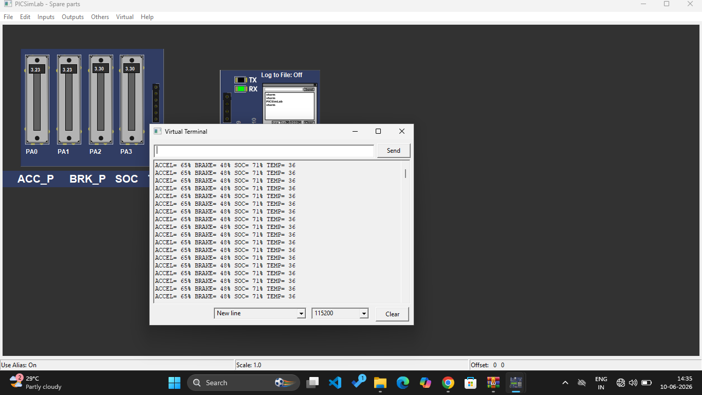

# Day 3 - ADC Multi-Channel + UART

**MCU:** STM32F103C8T6 Blue Pill  
**Date:** 10-06-2026  
**Task:** Read PA0-PA3 ADC values and send via UART at 115200 baud

**Channels:**
- PA0 = ACC_P - Accelerator Pedal
- PA1 = BRK_P - Brake Pedal  
- PA2 = SOC - Battery Level
- PA3 = TEMP - Temperature

### PICSimLab Output

